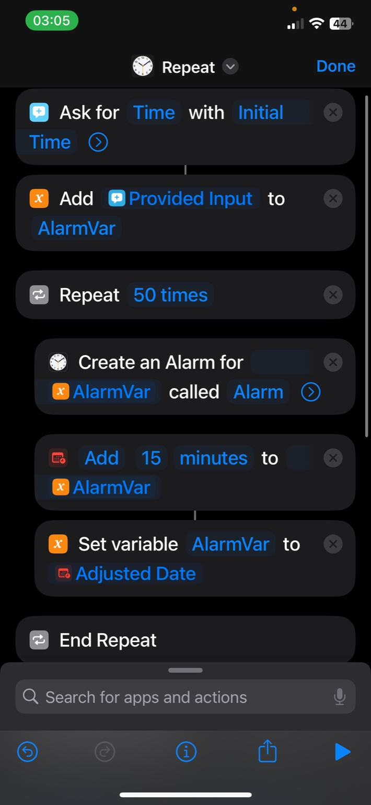

# 4. JavaScript Algorithm Challenge: Incremental Alarms



## Challenge

You are tasked with writing a JavaScript function that automates the creation of multiple alarms. Each alarm will be set at a specified starting time, and then additional alarms will be set in intervals of 15 minutes after the previous alarm. The goal is to create **10** alarms in total.

## Instructions

1. Write a function that takes in an initial time (in the format `HH:MM`).
2. The function should create and return **10** alarm times, starting from the initial time.
3. Each subsequent alarm should be 15 minutes later than the previous one.

**Notes:**

- Ensure that time calculation handles the addition of minutes correctly (e.g., 11:50 + 15 minutes should become 12:05, not 11:65).
- The function should work for any valid time input (from `00:00` to `23:59`).

**Hint:**

- You should use military time instead of standard time for easier time conversion.
- Store each alarm time in a list and return the list.

**Examples:**

1. If the function is called with the input `"09:00"`, the alarms would be:

```
09:00
09:15
09:30
09:45
10:00
10:15
10:30
10:45
11:00
11:15
```

2. Similarly, if the function is called with the input `"00:00"`, the alarms would be:

```
00:00
00:15
00:30
00:45
01:00
01:15
01:30
01:45
02:00
02:15
```

**Helpful Links:**

- [Loops | MDN](https://developer.mozilla.org/en-US/docs/Web/JavaScript/Guide/Loops_and_iteration)
- [Date | MDN](https://developer.mozilla.org/en-US/docs/Web/JavaScript/Reference/Global_Objects/Date)
- [String.prototype.split() | MDN](https://developer.mozilla.org/en-US/docs/Web/JavaScript/Reference/Global_Objects/String/split)
- [Array.prototype.map() | MDN](https://developer.mozilla.org/en-US/docs/Web/JavaScript/Reference/Global_Objects/Array/map)
- [String.prototype.padStart() | MDN](https://developer.mozilla.org/en-US/docs/Web/JavaScript/Reference/Global_Objects/String/padStart)
